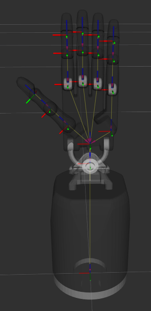

Meshes
========

Dexterous Hand
--------------

  
===========  =========================================================  =========================================================  ============================
Fingers (Index to Ring)
---------------------------------------------------------------------------------------------------------------------------------------------------------------
Name         Visual Mesh                                                Collision Mesh                                             Coordinate System placed in
===========  =========================================================  =========================================================  ============================
Distal       `<hand/distal.stl>`_                                       `<hand/distal_collision.stl>`_                             Asm_Distal
Middle       `<hand/middle.stl>`_                                       `<hand/middle_collision.stl>`_                             Asm_Middle_Right
Proximal     `<hand/proximal.stl>`_                                     `<hand/proximal_collision.stl>`_                           Asm_Proximal_Hub
Knuckle      `<hand/knuckle.stl>`_                                      Geometry:<cylinder length="0.014" radius="0.007"/>         Asm_Knuckle
===========  =========================================================  =========================================================  ============================

===========  =========================================================  =========================================================  ============================
Little finger
---------------------------------------------------------------------------------------------------------------------------------------------------------------
Name         Visual Mesh                                                Collision Mesh                                             Coordinate System placed in
===========  =========================================================  =========================================================  ============================
Metacarpal   `<hand/lfmetacarpal.stl>`_                                 `<hand/lfmetacarpal_collision.stl>`_                       Asm_Lttle_Metacarpal
===========  =========================================================  =========================================================  ============================

===========  =========================================================  =========================================================  ============================
Thumb
---------------------------------------------------------------------------------------------------------------------------------------------------------------
Name         Visual Mesh                                                Collision Mesh                                             Coordinate System placed in
===========  =========================================================  =========================================================  ============================
Distal       `<hand/thdistal.stl>`_                                     `<hand/thdistal_collision_z.stl>`_                         Asm_Thumb_Distal
Middle       `<hand/thmiddle_z.stl>`_                                   `<hand/thmiddle_collision.stl>`_                           Asm_Thumb_Middle
Proximal     `<hand/thproximal.stl>`_                                   `<hand/thproximal_collision.stl>`_                         Asm_Thumb_Proximal
===========  =========================================================  =========================================================  ============================

=================  ===================================================  =========================================================  ============================
Others
---------------------------------------------------------------------------------------------------------------------------------------------------------------
Name               Visual Mesh                                          Collision Mesh                                             Coordinate System placed in
=================  ===================================================  =========================================================  ============================
Palm               `<hand/palm.stl>`_                                   `<hand/palm.stl>`_                                         Asm_Palm
Wrist              `<hand/wrist.stl>`_                                  `<hand/wrist.stl>`_                                        Asm_Wrist_Pitch
Forearm            `<hand/forearm.stl>`_                                `<hand/forearm.stl>`_                                      Asm_Motor_Base_M5_EDC
Cable_connector    `<hand/cable_connector.stl>`_                        `<hand/cable_collision.stl>`_
=================  ===================================================  =========================================================  ============================

Dexterous Hand Plus
--------------------

=================  ===================================================  =========================================================  ============================
Others
---------------------------------------------------------------------------------------------------------------------------------------------------------------
Name               Visual Mesh                                          Collision Mesh                                             Coordinate System placed in
=================  ===================================================  =========================================================  ============================
Forearm Plus       `<hand/forearm_plus.stl>`_                           `<hand/forearm_plus_collision.stl>`_                       Asm_?
Cable_connector    `<hand/cable_connector.stl>`_                        `<hand/cable_collision.stl>`_                              Asm_?
=================  ===================================================  =========================================================  ============================

Dexterous Hand Lite
--------------------

===========  =========================================================  ===============================================  ============================
Others
-----------------------------------------------------------------------------------------------------------------------------------------------------
Name         Visual Mesh                                                Collision Mesh                                   Coordinate System placed in
===========  =========================================================  ===============================================  ============================
Forearm      `<hand/forearm_lite.stl>`_                                 `<hand/forearm_lite.stl>`_                       base_Simplified
===========  =========================================================  ===============================================  ============================

UR Arms
-------

==============  =============================================  ========================================================  ============================
Others
-----------------------------------------------------------------------------------------------------------------------------------------------------
Name            Visual Mesh                                    Collision Mesh                                            Coordinate System placed in
==============  =============================================  ========================================================  ============================
Mounting plate  `<hand/ur_mounting_plate.stl>`_                `<hand/ur_mounting_plate_collision.stl>`_                 C6M2_to_UR5-UR10,00
==============  =============================================  ========================================================  ============================

Joints
========

+-----------------+-----------------+----------------------------------------------------------------+
|  Joint parent   |   Joint child   |                             origin                             |
+-----------------+-----------------+----------------------------------------------------------------+
| rh_forearm      | rh_wrist        | <origin rpy="0 0 0" xyz="0 -0.010 0.213"/>                     |
+-----------------+-----------------+----------------------------------------------------------------+
| rh_wrist        | rh_palm         | <origin rpy="0 0 0" xyz="0 0 0.034"/>                          |
+-----------------+-----------------+----------------------------------------------------------------+
| rh_palm         | rh_ffknuckle    | <origin rpy="0 0 0" xyz="0.033 0 0.095"/>                      |
+-----------------+-----------------+----------------------------------------------------------------+
| rh_ffknuckle    | rh_ffproximal   | <origin rpy="0 0 0" xyz="0 0 0"/>                              |
+-----------------+-----------------+----------------------------------------------------------------+
| rh_ffproximal   | rh_ffmiddle     | <origin rpy="0 0 0" xyz="0 0 0.045"/>                          |
+-----------------+-----------------+----------------------------------------------------------------+
| rh_ffmiddle     | rh_ffdistal     | <origin rpy="0 0 0" xyz="0 0 0.025"/>                          |
+-----------------+-----------------+----------------------------------------------------------------+
| rh_ffdistal     | rh_fftip        | <origin rpy="0 0 0" xyz="0 0 0.026"/>                          |
+-----------------+-----------------+----------------------------------------------------------------+
| rh_palm         | rh_mfknuckle    | <origin rpy="0 0 0" xyz="0.011 0 0.099"/>                      |
+-----------------+-----------------+----------------------------------------------------------------+
| rh_mfknuckle    | rh_mfproximal   | <origin rpy="0 0 0" xyz="0 0 0"/>                              |
+-----------------+-----------------+----------------------------------------------------------------+
| rh_mfproximal   | rh_mfmiddle     | <origin rpy="0 0 0" xyz="0 0 0.045"/>                          |
+-----------------+-----------------+----------------------------------------------------------------+
| rh_mfmiddle     | rh_mfdistal     | <origin rpy="0 0 0" xyz="0 0 0.025"/>                          |
+-----------------+-----------------+----------------------------------------------------------------+
| rh_mfdistal     | rh_mftip        | <origin rpy="0 0 0" xyz="0 0 0.026"/>                          |
+-----------------+-----------------+----------------------------------------------------------------+
| rh_palm         | rh_rfknuckle    | <origin rpy="0 0 0" xyz="-0.011 0 0.095"/>                     |
+-----------------+-----------------+----------------------------------------------------------------+
| rh_rfknuckle    | rh_rfproximal   | <origin rpy="0 0 0" xyz="0 0 0"/>                              |
+-----------------+-----------------+----------------------------------------------------------------+
| rh_rfproximal   | rh_rfmiddle     | <origin rpy="0 0 0" xyz="0 0 0.045"/>                          |
+-----------------+-----------------+----------------------------------------------------------------+
| rh_rfmiddle     | rh_rfdistal     | <origin rpy="0 0 0" xyz="0 0 0.025"/>                          |
+-----------------+-----------------+----------------------------------------------------------------+
| rh_rfdistal     | rh_rftip        | <origin rpy="0 0 0" xyz="0 0 0.026"/>                          |
+-----------------+-----------------+----------------------------------------------------------------+
| rh_palm         | rh_lfmetacarpal | <origin rpy="0 0 0" xyz="-0.033 0 0.02071"/>                   |
+-----------------+-----------------+----------------------------------------------------------------+
| rh_lfmetacarpal | rh_lfknuckle    | <origin rpy="0 0 0" xyz="0 0 0.06579"/>                        |
+-----------------+-----------------+----------------------------------------------------------------+
| rh_lfknuckle    | rh_lfproximal   | <origin rpy="0 0 0" xyz="0 0 0"/>                              |
+-----------------+-----------------+----------------------------------------------------------------+
| rh_lfproximal   | rh_lfmiddle     | <origin rpy="0 0 0" xyz="0 0 0.045"/>                          |
+-----------------+-----------------+----------------------------------------------------------------+
| rh_lfmiddle     | rh_lfdistal     | <origin rpy="0 0 0" xyz="0 0 0.025"/>                          |
+-----------------+-----------------+----------------------------------------------------------------+
| rh_palm         | rh_thbase       | <origin rpy="0 0.785398163397 0.0" xyz="0.034 -0.0085 0.029"/> |
+-----------------+-----------------+----------------------------------------------------------------+
| rh_thbase       | rh_thproximal   | <origin rpy="0 0 0" xyz="0 0 0"/>                              |
+-----------------+-----------------+----------------------------------------------------------------+
| rh_thproximal   | rh_thhub        | <origin rpy="0 0 0" xyz="0 0 0.038"/>                          |
+-----------------+-----------------+----------------------------------------------------------------+
| rh_thhub        | rh_thmiddle     | <origin rpy="0 0 0" xyz="0 0 0"/>                              |
+-----------------+-----------------+----------------------------------------------------------------+
| rh_thmiddle     | rh_thdistal     | <origin rpy="0 0 -1.57079632679" xyz="0 0 0.032"/>             |
+-----------------+-----------------+----------------------------------------------------------------+
| rh_thdistal     | rh_thtip        | <origin rpy="0 0 0" xyz="0 0 0.0275"/>                         |
+-----------------+-----------------+----------------------------------------------------------------+

Mesh Generation Process in Solidworks
======================================

To generate the meshes for the urdf models, it is required to save as STL the assemblies in the proper coordinate system, both mentioned above. See example below.

To get ``F1`` you need:

1. Open in SolidWorks: ``Asm_Distal``
2. Choose the correct configuration (in this case with the desired fingertip) 
3. Save the STL in the the custom coordinate System:

   * Start by checking if there is a configuration with the reference ``XACRO``. This configuration has unnecessary components suppressed making the files lighter to work with.
   * Save the .STl in the name used by in the tables, in this case is ``F1``. Select Options before saving, set the resolution to course, check if you have the same checkboxes ticked and change the output coordinate system to the indicated in this document, in this case the ``Coordinate System1``.
   
.. image:: img/solidworks_configuration.png
  :width: 100%
  

Generating coordinate system
----------------------------

If this is a new assembly or part, you might have to create a custom coordinate system. On the top bar do: ``Insert->Reference Geometry->Coordinate System``. For locating the point and axis orientation check the table in this document.
